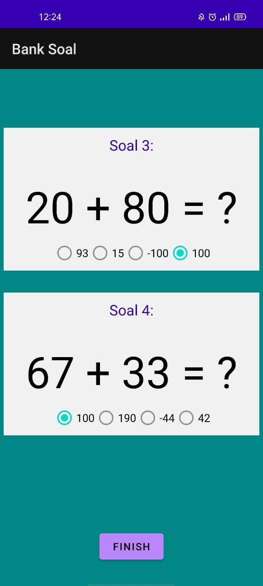

Source code of my android lab project==> Bank Soal.

Here are some Youtube Links that have helped me in the process of developing this simple Android App:
-How to Pass data from One to another Activity || Android studio tutorial https://www.youtube.com/watch?v=Yi8mxXsroJ4
-How to Pass Data from One Activity to Another in Android Studio | Sanktips https://www.youtube.com/watch?v=9u6FkCCflhc
-How to Open a New Activity and Pass Variables to It - Android Studio Tutorial https://www.youtube.com/watch?v=eL69kj-_Wvs
-Send Data Back from Child Activity with startActivityForResult - Android Studio Tutorial https://www.youtube.com/watch?v=AD5qt7xoUU8

This is some screenshoot of how the app run in android:

By Muhammad Irsyad (2019302029)
Pemograman Mobile (Android) Semester 4
